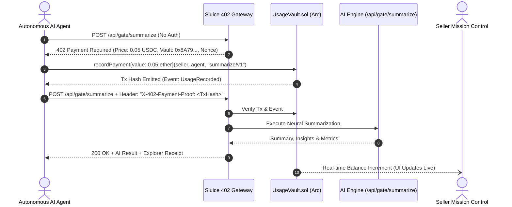

# Sluice Architecture & Technical Specification

## 1. System Components

Sluice is structured into three decoupled layers:
1. **On-Chain Settlement Layer (`UsageVault.sol`):**
   - Implemented in Solidity 0.8.20.
   - Manages multi-seller accounting without requiring proxy upgrades.
   - Enforces the Checks-Effects-Interactions pattern for payouts.
   - Emits `UsageRecorded` events that form the on-chain audit ledger.

2. **HTTP 402 Gateway Middleware (`/api/gate/*`):**
   - Intercepts inbound machine API requests.
   - Emits RFC-compliant HTTP 402 challenges with structured JSON metadata (`price`, `token`, `chainId`, `vault`).
   - Verifies incoming payment proofs before invoking the target AI microservice.

3. **Meridian Mission Control & Visual Telemetry:**
   - Real-time seller dashboard monitoring vault balance and active rate metrics.
   - Interactive testing playground allowing human judges and AI agents to test the 402 challenge-response flow live.
   - Recessed terminal audit ledger streaming verified events directly from the network.

---

## 2. Sequence Flow



---

## 3. Security & Integrity Invariants

- **Zero Database Lock-in:** The smart contract is the canonical source of truth. If the Sluice web server goes down, historical earnings and withdrawable balances remain completely intact on Arc.
- **Reentrancy Protection:** All withdrawals follow strict balance zeroing before external transfer:
  ```solidity
  uint256 available = profile.balance;
  if (available < threshold) revert ThresholdNotMet(available, threshold);
  profile.balance = 0; // State updated before external call
  (bool success, ) = payable(msg.sender).call{value: available}("");
  if (!success) revert WithdrawFailed();
  ```
- **Customizable Withdrawal Thresholds:** Sellers can prevent micro-dust withdrawals by setting thresholds (e.g., minimum 1.00 USDC), saving gas and batching treasury transfers.
